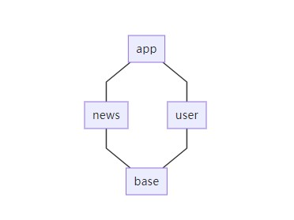

### 普通多模块项目（非组件化、插件化项目）Dagger2依赖方式选择
使用SubComponent组织
参考[Google官方](https://developer.android.google.cn/training/dependency-injection/dagger-multi-module)

假设项目模块结构如下图



在普通多模块项目中，app直接依赖news与user模块，可以直接引用其中的类

app中放Appcomponent其它模块用SubComponent继承Appcomponent

base模块

```kotlin
open class BaseApplication : Application() {
    override fun onCreate() {
        super.onCreate()
        instance = this
    }

    companion object {
        lateinit var instance: BaseApplication
    }
}
```

app模块

注意AppComponent不是放在base模块

```kotlin
@Singleton
@Component(modules = [AppModule::class])
interface AppComponent {
    @Component.Factory
    interface Factory {
        fun create(@BindsInstance context: Context): AppComponent
    }
}
```

```kotlin
@Module
class AppModule {
    @IntoSet
    @Provides
    fun provideString(): String {
        return "app"
    }
}
```

```kotlin
class AppApplication : BaseApplication() {
    lateinit var appComponent: AppComponent
    override fun onCreate() {
        super.onCreate()
        appComponent = DaggerAppComponent.factory().create(this)
    }
}
```

user模块

```kotlin
@Module
class UserModule {
    @IntoSet
    @Provides
    fun provideString(): String {
        return "user"
    }
}
```

```kotlin
@UserScope
@Subcomponent(modules = [UserModule::class])
interface UserComponent {
    @Subcomponent.Factory
    interface Factory {
        fun create(): UserComponent
    }
}
```

news模块

```kotlin
@Module
class NewsModule {
    @IntoSet
    @Provides
    fun provideString(): String {
        return "news"
    }
}
```

```kotlin
@Subcomponent(modules = [NewsModule::class])
interface NewsComponent {

    @Subcomponent.Factory
    interface Factory {
        fun create(): NewsComponent
    }
}
```

根据SubComponent的原理NewsComponent和UserComponent必须在AppComponent注册它们

```kotlin
@Module(subcomponents = [NewsComponent::class, UserComponent::class])
class AppModule {
    @IntoSet
    @Provides
    fun provideString(): String {
        return "app"
    }
}
```

```kotlin
@Singleton
@Component(modules = [AppModule::class])
interface AppComponent {
    @Component.Factory
    interface Factory {
        fun create(@BindsInstance context: Context): AppComponent
    }

    fun newsComponentFactory(): NewsComponent.Factory

    fun userComponentFactory(): UserComponent.Factory
}
```

要生成NewsComponent和UserComponent必须先得到AppComponent,通过以下方法来创建

```kotlin
val newsComponent = appComponent.newsComponentFactory().create()
val userComponent = appComponent.userComponentFactory().create()
```

但是显然，user,news模块拿不到appComponent

这里用两个接口来获得

```kotlin
interface NewsComponentProvider {
    fun provideNewsComponent(): NewsComponent
}
interface UserComponentProvider {
    fun provideUserComponent(): UserComponent
}
```

让AppApplication实现这两个接口

```kotlin
class AppApplication : BaseApplication(), NewsComponentProvider, UserComponentProvider {
    lateinit var appComponent: AppComponent
    override fun onCreate() {
        super.onCreate()
        appComponent = DaggerAppComponent.factory().create(this)
    }

    override fun provideNewsComponent(): NewsComponent {
        return appComponent.newsComponentFactory().create()
    }

    override fun provideUserComponent(): UserComponent {
        return appComponent.userComponentFactory().create()
    }
}
```

然后user,news模块中这样获取

```kotlin
val userComponent = (BaseApplication.instance as UserComponentProvider).provideUserComponent()
val newsComponent = (BaseApplication.instance as NewsComponentProvider).provideNewsComponent()
```

通常UserComponent与NewsComponent只要一个实例，上面方法每次都他建一个新实例不合适，可以把它们放到一个全局变量中去

```kotlin
object NewsComponentHolder {
    val newsComponent: NewsComponent by lazy {
        (BaseApplication.instance as NewsComponentProvider).provideNewsComponent()
    }
}
object UserComponentHolder {
    val userComponent: UserComponent by lazy {
        (BaseApplication.instance as UserComponentProvider).provideUserComponent()
    }
}
```

最后在Activity中这样用

```kotlin
class NewsActivity : AppCompatActivity() {

    @Inject
    lateinit var set: Set<String>

    override fun onCreate(savedInstanceState: Bundle?) {
        super.onCreate(savedInstanceState)
        setContentView(R.layout.activity_news)
        NewsComponentHolder.newsComponent.inject(this)
        text.text = set.toString()
    }
}

class UserActivity : AppCompatActivity() {

    @Inject
    lateinit var set: Set<String>

    override fun onCreate(savedInstanceState: Bundle?) {
        super.onCreate(savedInstanceState)
        setContentView(R.layout.activity_user)
        UserComponentHolder.userComponent.inject(this)
        text.text = set.toString()
    }
}
```